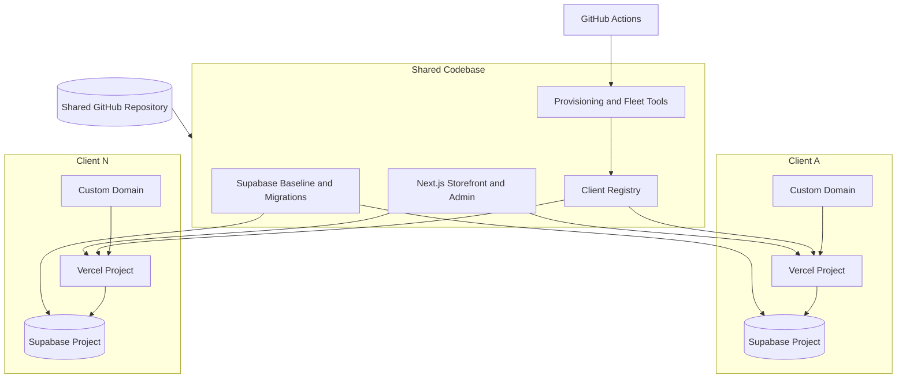
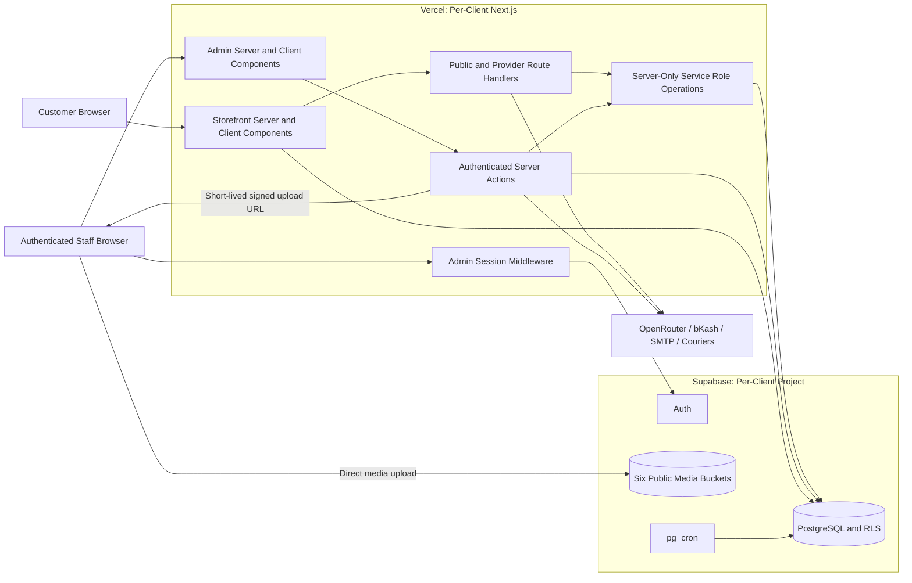
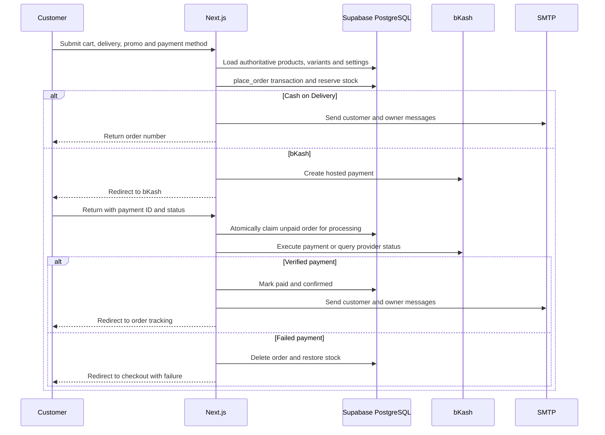
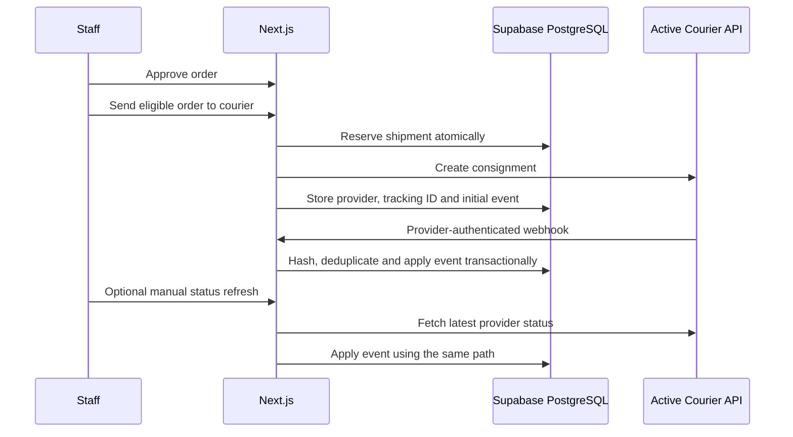

# Reverb Commerce Architecture

## System Scope

Reverb Commerce is a multi-store commerce platform built from one shared codebase.
Each client receives an isolated Vercel deployment and an isolated Supabase
project. Stores share application code, while their domain, schema version,
content, catalog, branding, users, integration settings and business data remain
independent.



Every client deploys the same application code. A capability is usable only when
the client has the required schema migration, tenant setting and external
credential.

## Repository Structure

```text
frontend/website/                 Next.js storefront, admin and API runtime
backend/supabase/baselines/       Clean database baseline for new stores
backend/supabase/migrations/      Versioned database and storage changes
backend/supabase/seed/            Store initialization data
backend/scripts/                  Provisioning, registry, status and cleanup tools
backend/clients/<client-id>/      Tracked non-secret client inventory
ops/schemas/                      Tenant manifest contract
.github/workflows/                New-store provisioning and asset cleanup
doc/                              Feature-guide PDF, generator and architecture
.client-secrets/                  Ignored local provisioning credentials
```

The backend directory is a database and control-plane package, not a separately
deployed HTTP API. Next.js is the application server.

## Product Capability Map

### Customer storefront

- Dynamic homepage assembled from merchant-ordered banner, category, featured
  product, review, promotion and rich-text sections.
- Responsive catalog, featured merchant ordering, category, availability and
  price filters, and price or alphabetical sorting.
- Full-screen product search and a conversational AI store expert grounded in
  current website content and available products.
- Product galleries, rich descriptions, live stock, optional sizing, optional
  product-specific size charts and stock-aware quick shopping.
- Browser-persistent cart, wishlist and checkout form state without customer
  registration.
- Guest checkout with Inside Dhaka or Outside Dhaka delivery charges, promo
  codes, Cash on Delivery and optional bKash payment.
- Public order-number lookup with payment, order, item and courier event status.
- Reviews, contact, About, Privacy, Terms and Refund content.
- Dynamic metadata, canonical URLs, Product structured data, sitemap, robots
  rules, product CSV feed, analytics, Meta Pixel events and chat links.

### Merchant administration

- Dashboard KPIs, seven-day charts, recent orders and operational shortcuts.
- Product and category CRUD, merchant ordering, protected default category,
  optional sizing, variants, SKUs, stock thresholds, image galleries and size
  charts.
- Alphabetical, collapsible inventory groups with combined stock and expandable
  variant details.
- Order approval, status management, internal notes, customer history, reports
  and CSV exports.
- Pathao, Steadfast and REDX shipment creation, refresh and event history.
- Individual branded PDF invoices and bulk ZIP generation for up to 50 orders,
  with an optional print-safe invoice logo.
- Homepage, banner, About, policy, promotion, promo-code, review and contact
  content management.
- Branding, five theme presets and custom colors, delivery, SMTP, bKash,
  courier, analytics and chat settings.
- Admin, editor and viewer roles plus append-only audit records.
- Six media libraries, signed uploads, storage estimates and operational asset
  cleanup tooling.

## Runtime Topology

The application uses Next.js 16 App Router, React 19 and TypeScript. Storefront
and admin routes are dynamic and favor current Supabase data over shared page
caching. Route Handlers and Server Actions use the Node.js runtime for payment,
email, PDF data preparation, privileged database operations and external APIs.



### Browser state

Customers do not have accounts. Zustand stores persist the cart, wishlist and
checkout form in browser storage. A separate saved-delivery record is written
when the customer selects the save option. This means anonymous delivery data
can remain on the device until browser storage is cleared.

The AI conversation is held in component memory and is not persisted to the
store database.

## Next.js and Supabase Boundary

- Storefront reads and staff operations normally pass through Server Components,
  Route Handlers or Server Actions.
- Cookie-bound Supabase sessions support admin authentication and RLS-governed
  staff access.
- The service-role client is server-only and bypasses RLS. It is used for
  transactional order placement, public order tracking, Auth administration,
  private integration settings, audit writes, signed upload creation and courier
  event processing.
- Media uploads use short-lived signed upload URLs. The image body travels from
  the authenticated admin browser directly to Supabase Storage.
- Product and review uploads accept JPG, PNG or WebP input, reject HEIC/HEIF,
  resize large images, remove metadata and produce WebP output within configured
  size limits.
- The authenticated settings interface is trusted with editable courier
  configuration, including webhook values required to configure providers.

## Authentication and Authorization

Supabase Auth provides staff email/password authentication. New-store
provisioning disables public signup, creates a bootstrap user and explicitly
assigns the administrator role.

Authorization is layered:

1. Middleware refreshes the Supabase session and protects `/admin` routes.
2. Admin layouts and pages load the staff profile and filter available modules.
3. Server Actions enforce admin, editor or viewer permissions.
4. PostgreSQL RLS controls table access.
5. Selected trusted server paths use the service role when public or privileged
   behavior cannot be expressed through a staff session.

Public RLS policies permit active catalog/content reads and contact submission.
Operational writes require staff access. User administration, private settings
and audit reads are administrator-only.

## Data Architecture

### Core domains

| Domain | Main records |
| --- | --- |
| Identity | profiles and staff roles |
| Catalog | categories, products, product images, variants and category assignments |
| Commerce | customers, orders and immutable order-item snapshots |
| CMS | banners, homepage sections, content pages, promotions and reviews |
| Operations | contact submissions, site settings, promo codes and blocked-IP records |
| Integrations | SMTP, bKash and courier settings |
| Fulfilment | order shipments and courier event history |
| Governance | append-only audit logs and provisioning migration ledger |

The CMS is hybrid. Newer content uses normalized tables, while compatible legacy
and configuration content remains under the `_cms` object in
`site_settings.socials`. Content readers prefer normalized records and use the
stored object or defaults as fallback.

### Database invariants

- A protected default category is pinned first and represents the complete
  catalog; merchant-created categories remain reorderable and deletable.
- Product sizing is optional. Every purchasable item still resolves to an
  inventory variant so stock and cart identity remain consistent.
- Order placement locks variants, verifies prices and stock, snapshots item
  details, updates the customer, calculates totals and decrements stock in one
  transaction.
- Cancellation, failed-payment cleanup and deletion restore stock through
  database functions.
- Only one courier may be active for new shipments. Existing shipments retain
  their original provider.
- Courier events are deduplicated and may only advance the main order workflow
  monotonically.
- Audit rows are append-only to application roles.

## Order, Payment and Notification Flow



The server does not trust client prices, stock, shipping charges or promo totals.
It reloads authoritative values before calling the service-role-only order RPC.
Email failure does not roll back an accepted order.

Migration `0018_abandoned_gateway_orders.sql` installs a `pg_cron` job that runs
every 15 minutes. It deletes unpaid non-COD orders older than one hour and
restores stock transactionally. Paid, COD, recent and courier-linked orders are
excluded.

Public tracking uses possession of an order number rather than customer
authentication. It returns order items, customer summary, delivery area, payment
state, totals and courier history.

## Courier Flow



Pathao and REDX require parcel weight; REDX also requires a provider delivery
area. COD orders are eligible, while bKash orders must be paid. Courier-linked
orders cannot be cancelled, moved to another provider or deleted locally.
Failure, hold, return, partial-delivery and unknown provider events are retained
without automatically cancelling, restocking or regressing the order.

## AI Store Expert

The public AI route builds two request-time knowledge sets. The first contains up
to 120 active products, excludes products without a positive-stock variant and
derives currently available colors and sizes. The second contains public store
settings, delivery charges, About content, homepage sections, banners, policies,
categories, promotions, reviews and navigation guidance.

The bounded recent conversation and both knowledge sets are sent to OpenRouter
using structured output. The model can return an informational answer, one
clarifying question, a no-match response or up to three product recommendations.
It may also return up to four website source identifiers. The server checks source
identifiers against the request knowledge map and product identifiers against the
stock-filtered catalog before attaching server-owned links, prices and images.

Website and catalog content are treated as untrusted data rather than model
instructions. The prompt forbids invented store policies, contact details,
delivery terms, discounts, reviews, product details and availability, and directs
the visitor to a relevant page or contact route when current content cannot
answer the question. Supported wrapped or fenced JSON response forms are
recovered. Conversation history is not stored in Supabase.

## Storage and Asset Lifecycle

Supabase provides six public-read buckets:

- product images;
- category images;
- review images;
- promotion images;
- branding;
- banner images.

Staff writes are authorized before a server action creates a signed upload URL.
Product and review files have additional WebP and size restrictions. Database
records and CMS content hold the references used by storefront rendering.

The manually dispatched cleanup workflow discovers active registered clients and
runs up to five jobs in parallel. Each job:

1. Resolves the correct project credential without adding it to the matrix.
2. Paginates all database references and recursively lists storage objects.
3. Protects referenced files, seed prefixes and files newer than 24 hours.
4. Deletes remaining objects in batches.

The workflow currently performs deletion when dispatched. Dry-run behavior is
available through the backend CLI by passing `--dry-run`.

## Client Provisioning

The primary onboarding path is the protected `Deploy New Customer` GitHub Actions
workflow. It accepts a site URL and temporary Supabase Management API token,
validates the repository, then runs the resumable store provisioner.

```mermaid
sequenceDiagram
    participant Operator
    participant Actions as GitHub Actions
    participant Provisioner
    participant Supabase
    participant Vercel
    participant Registry as Client Registry

    Operator->>Actions: Site URL and temporary Supabase token
    Actions->>Actions: Backend tests and validation; frontend test, lint and build
    Actions->>Provisioner: Run resumable provisioning at selected release SHA
    Provisioner->>Supabase: Create project and wait for health
    Provisioner->>Supabase: Apply baseline, migrations and checksum ledger
    Provisioner->>Supabase: Seed data, assets, Auth policy and bootstrap admin
    Provisioner->>Vercel: Create/configure project and production environment
    Provisioner->>Vercel: Deploy exact release SHA and attach domains
    Provisioner->>Vercel: Run initial health and route smoke tests
    Provisioner->>Registry: Write tenant and deployment inventory
    Actions->>Registry: Validate and commit generated files to main
```

Provisioning derives the Vercel project name as `store-<client-id>`, configures
`frontend/website` as the project root and writes non-privileged registry data.
The generated inventory includes tenant metadata, deployment status, schema and
migration checksums, an environment backup with privileged fields blank, and a
client operations README.

### Registry and secrets

| Location | Contents | Tracked |
| --- | --- | --- |
| `backend/clients/<id>/tenant.json` | Client identity, domain, project reference and desired schema | Yes |
| `backend/clients/<id>/deployment.json` | Release, deployment, domain, schema and smoke-test metadata | Yes |
| `backend/clients/<id>/environment.backup.json` | Non-privileged environment inventory; secret fields blank | Yes |
| `.client-secrets/<id>.env` | Local provisioning and service credentials | No |
| Vercel production environment | Runtime Supabase and site configuration | No |
| GitHub Actions secrets | Vercel and fleet-management credentials | No |
| Private Supabase tables | SMTP, bKash and courier credentials | Database only |

## Release and Scaling Model

New stores are initially deployed from an exact release SHA. Their Vercel
projects are also connected to the shared repository and `main`, so subsequent
frontend-affecting changes use Vercel Git deployment behavior. Client differences
come from isolated data, environment, domain and merchant configuration rather
than branches or copied applications.

Adding a client adds one registry folder, one Vercel project and one Supabase
project. It does not add a source branch. Fleet asset cleanup discovers active
registry entries dynamically and limits parallel load to five clients.

## Current Operational Boundaries

These statements describe the current repository rather than future intent:

- New-store provisioning installs the latest schema, but no repository workflow
  currently rolls pending migrations across existing clients. Registry schema
  versions must therefore be checked and upgraded through an operator-managed
  process.
- Initial provisioning performs smoke tests. There is no recurring repository
  workflow that smoke-tests every client after normal Vercel deployments.
- The asset-cleanup workflow is manually triggered and destructive by default;
  dry-run is a separate CLI option.
- Public order creation, tracking, contact, search, promo validation, product
  feed and AI routes do not have an application-level rate limiter or CAPTCHA.
- Order tracking is authorized only by knowledge of the order number.
- Blocked-IP records can be managed in the admin database, but request middleware
  does not currently enforce them. The optional anti-inspection browser script
  is a deterrent, not a server security control.
- Private integration credentials are plaintext values inside each isolated
  Supabase database and rely on project isolation, RLS and trusted server access
  rather than application-layer encryption.
- The OpenRouter credential is currently loaded from tracked server-only source
  configuration instead of deployment secret management and should be rotated
  and moved before treating the repository as secret-free.
- Audit insertion is best effort, and audit-write failure does not block the
  underlying merchant operation.
- Dynamic no-store rendering prioritizes immediate catalog and admin freshness
  over shared response caching.
