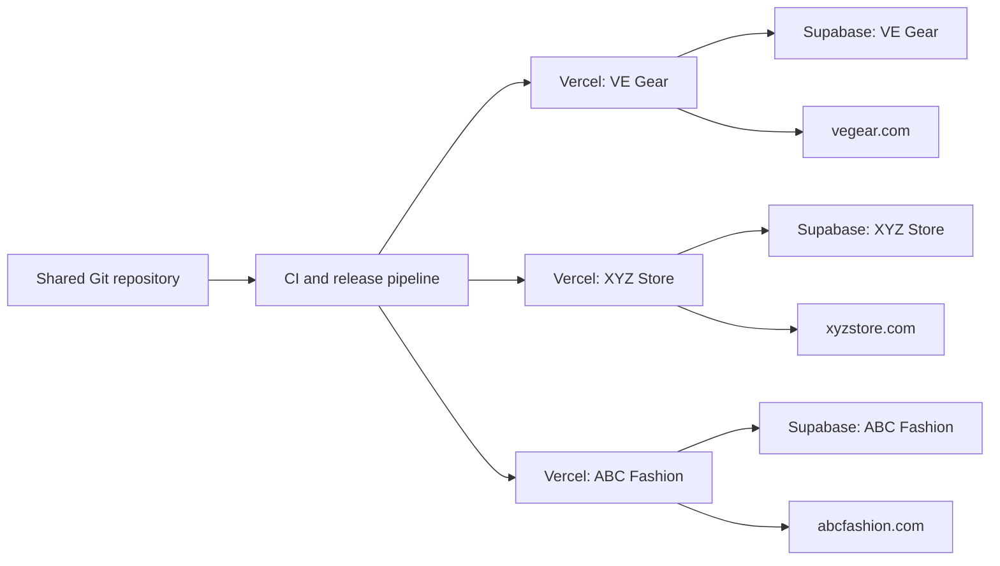
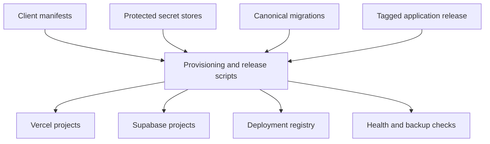
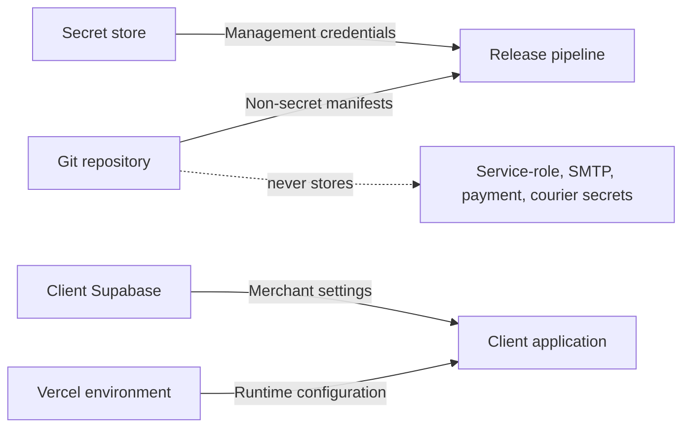
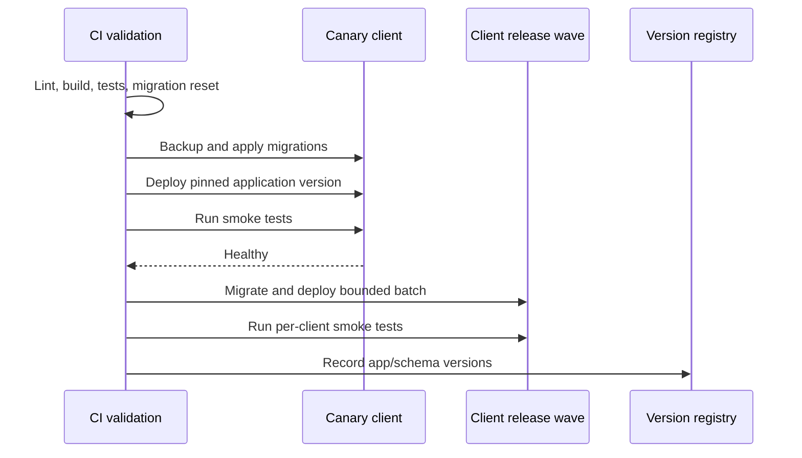
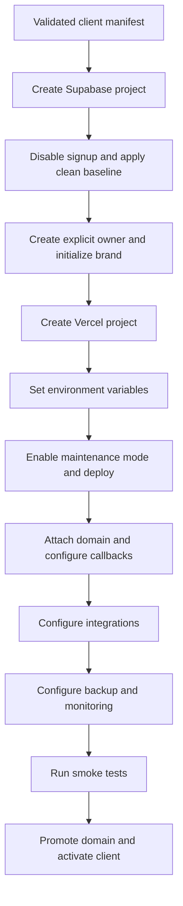
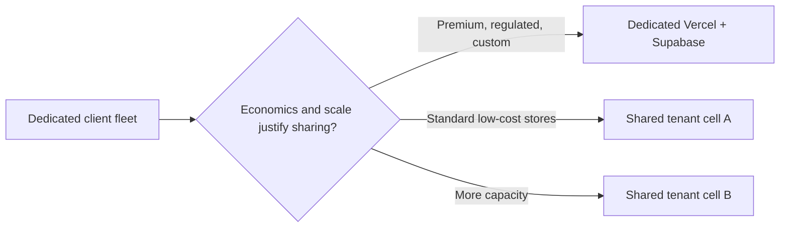

# Reverb Commerce Scalability and Client Deployment Plan

**Owner:** Reverb Solution<br>
**Status:** Architecture proposal
**Last updated:** 09 August 2026

## 1. Executive Summary

Reverb Commerce originated as the VE Gear store. The goal is to provide the product to multiple independent merchants while maintaining one shared codebase.

The recommended near-term architecture is:

- One shared application repository.
- One Vercel project per client.
- One Supabase project per client.
- One custom domain per client deployment.
- One canonical set of database migrations shared by every client.
- Per-client environment variables and secrets configured outside Git.
- Per-client branding and business settings stored in that client's database.
- A coordinated release process that deploys approved pinned application versions from the same codebase. Clients normally converge on the stable version but may temporarily differ during canary or delayed rollout.

This is a **dedicated single-tenant fleet**. It is not a shared multi-tenant SaaS database.

The approach is a strong fit for the existing code because the current schema and application assume exactly one store, one set of settings, one staff directory, and one global catalog per Supabase project.

> **Recommendation:** Use the dedicated model for the first clients. Invest in automation, security, migrations, monitoring, and provisioning before considering a shared multi-tenant database.

## 2. Proposed Business Model

Each merchant receives an isolated copy of the running application infrastructure while Reverb Solution maintains the product source code.

Examples:

| Client | Vercel project | Domain | Supabase project |
|---|---|---|---|
| VE Gear | `store-ve-gear` | `vegear.com` | `ve-gear-production` |
| XYZ Store | `store-xyz` | `xyzstore.com` | `xyz-store-production` |
| ABC Fashion | `store-abc` | `abcfashion.com` | `abc-fashion-production` |

Every Vercel project deploys from the same application codebase and receives different environment variables. The exact pinned commit may temporarily differ during controlled release waves.

Every Supabase project receives the same schema migrations, but stores different client data, users, settings, products, orders, media, SMTP credentials, payment credentials, and courier credentials.



## 3. Is the Proposed Approach Scalable?

### 3.1 What works well

The proposed approach is practical for the current product and provides several important benefits:

- **Strong data isolation:** One client's products, customers, orders, staff, files, and credentials are isolated at the Supabase project boundary from another client's project.
- **Small failure blast radius:** A database or configuration issue affects one client instead of every merchant.
- **Independent backup and restore:** One merchant can be restored without restoring all merchants.
- **Simple domains and SEO:** Every deployment naturally has one canonical domain, sitemap, robots file, and payment callback URL.
- **Independent billing:** Infrastructure cost can be tracked or passed through per client.
- **Current-code compatibility:** The existing singleton settings and project-wide roles already match one store per project.
- **Client ownership options:** A client can own its Vercel and Supabase accounts while Reverb Solution remains the software maintainer.
- **Premium customization:** High-value clients can receive different release timing or infrastructure plans without changing the main architecture.

### 3.2 What does not scale automatically

The architecture scales operationally only after deployment tasks are automated.

Without automation, every additional client adds manual work for:

- Creating Vercel projects.
- Creating Supabase projects.
- Applying migrations.
- Adding environment variables.
- Creating the first administrator.
- Configuring domains and auth redirects.
- Enabling backups and monitoring.
- Running storage cleanup.
- Verifying releases.

The infrastructure cost also grows approximately linearly because each merchant has independent Vercel and Supabase resources.

This is acceptable during the early product stage because strong isolation and lower engineering risk are more valuable than minimum infrastructure cost.

### 3.3 Recommended scale stages

| Stage | Approximate clients | Recommended model |
|---|---:|---|
| Productization | 1-5 | Dedicated Vercel and Supabase projects, initially semi-automated |
| Managed fleet | 5-20 | Dedicated projects with automated provisioning and releases |
| Mature fleet | 20-50 | Dedicated projects with release waves, monitoring, backup registry, and support tiers |
| Platform scale | 50+ similar stores | Evaluate shared tenant cells for low-cost plans; retain dedicated projects for premium clients |

Client count is not the only decision factor. Revenue per client, traffic, compliance, customization, support expectations, and infrastructure cost matter more.

## 4. Current Repository State

### 4.1 The frontend is the application and backend runtime

`frontend/website` contains more than a browser frontend. It currently contains:

- The Next.js storefront.
- The admin panel.
- API route handlers.
- Server actions.
- Order placement logic.
- bKash callbacks.
- Courier API clients, shipment creation, status refresh, and authenticated webhooks.
- Email delivery.
- Supabase server and service-role clients.
- SEO, sitemap, analytics, feeds, and middleware.

The `backend` folder is not a separately deployed backend service. It currently contains:

- Supabase SQL migration files.
- Storage maintenance tooling.
- The Node package required by maintenance scripts.

The folders should eventually be understood as:

```text
frontend/website/   Shared web application and server runtime
backend/            Database schema, provisioning, and operational tooling
```

### 4.2 The application is currently single-store

The current design contains no `tenant_id` and assumes one merchant per Supabase project.

Examples:

- `site_settings` is a singleton row with `id = 1`.
- SMTP settings use one singleton row.
- bKash settings use one singleton row.
- Courier settings allow at most one active provider for new shipments.
- Staff profiles have one global role.
- Product slugs are globally unique.
- Customer phone numbers are globally unique.
- Order numbers are global within the project.
- Public RLS policies are project-wide rather than tenant-scoped.
- Service-role operations assume that the whole project belongs to one store.

This is why a separate Supabase project per client is the safest initial architecture.

### 4.3 Configuration is currently hardcoded

The application currently reads `frontend/website/config.json` and injects values through `next.config.ts`.

That file mixes:

- Public Supabase URL.
- Public Supabase anonymous key.
- Canonical site URL.
- Supabase service-role key.
- Gmail credentials.
- Notification recipients.

This prevents separate Vercel projects from safely using different client backends without changing committed source.

### 4.4 Critical security state

Privileged credentials have been committed in the current repository and exist in Git history.

The following must be considered exposed:

- Supabase service-role key.
- Gmail app password.

Immediate action is required:

1. Rotate the exposed Supabase service-role key.
2. Revoke and recreate the Gmail app password.
3. Remove inline credentials from `config.json` and the cleanup script.
4. Move all runtime secrets to Vercel environment variables.
5. Move operational secrets to protected GitHub environments or a secret manager.
6. Remove credentials from repository history where practical.

Removing a secret from the latest commit without rotating it is not sufficient.

### 4.5 Checkout and customer-data launch blockers

The following issues are not only scalability concerns. They must be corrected before onboarding an external client:

- The order API currently accepts customer-submitted item prices and subtotal values instead of rebuilding the order from authoritative product and variant records.
- The database order function can be called by the anonymous role and trusts its payload.
- Quantities, stock availability, variant ownership, and prices need authoritative server-side validation.
- Order creation, stock changes, and idempotency need one atomic transaction.
- Public order tracking uses a predictable order number and returns customer/order details without a second verifier.
- Checkout, promo validation, tracking, contact, and login endpoints have no application-level rate limiting.

Required pre-client remediation:

1. Load current products, variants, prices, and stock on the server.
2. Reject unknown, inactive, mismatched, out-of-stock, zero, or negative items.
3. Calculate subtotal, discount, delivery, and final total only on the server.
4. Use a tenant-local idempotency key to prevent duplicate orders or payment callbacks.
5. Restrict direct anonymous execution of privileged order functions.
6. Make order and stock updates atomic.
7. Replace tracking-by-number with an opaque tracking token or order number plus a second verifier.
8. Redact unnecessary tracking output and add rate limiting.
9. Add abuse controls to public write and lookup endpoints.

The automatic "first auth user becomes admin" behavior must also be removed before client provisioning. The owner should be created explicitly through a privileged provisioning path while public signup is disabled.

### 4.6 Schema and migration drift

The repository contains sequential SQL migrations, but there is no automated migration runner or tracked Supabase CLI configuration.

During the 06 August 2026 repository and live-project audit, the configured VE Gear project appeared not to be fully aligned with the migration sequence. Later schema objects were observed while expected CMS tables from earlier migrations were absent. This condition should be reverified directly before remediation.

Compatibility fallbacks currently hide part of this drift. That is useful for development but is not a reliable fleet-management strategy.

Before onboarding clients, the project needs one verified clean migration path that can create a complete database from zero.

## 5. Target Architecture

### 5.1 Application layer

Maintain one shared application in `frontend/website`.

Rules:

- Do not create a client-specific application copy.
- Do not create long-lived client branches.
- Do not hardcode client names, domains, assets, or credentials in source.
- Give every client the full product; store merchant configuration in database settings.
- Tag or pin every production release to a commit SHA.

### 5.2 Vercel layer

Create one Vercel project per client with:

- Root Directory: `frontend/website`.
- The same repository, with production promotion controlled by the release workflow.
- A pinned Node.js version.
- Client-specific environment variables.
- Client-specific custom domains.
- Separate Production, Preview, and Development values.
- Health and smoke-test checks after deployment.

Connecting internal projects directly to `main` can be convenient during development, but it has limitations:

- Deployments are not atomic.
- One project may fail while others succeed.
- Database migrations are not applied by Vercel.
- There is no central record showing which client runs which commit.
- A breaking release can affect every client simultaneously.

The mature approach is a release workflow that deploys a tested commit in controlled waves.

Preview policy must be explicit. A client production Vercel project must never point Preview deployments at the client's production Supabase project. Choose one of these models:

- Disable client-project previews and use one internal Reverb Solution staging deployment with disposable test data.
- Provision a separate staging Supabase project for clients whose contract requires client-specific preview/testing environments.

### 5.3 Supabase layer

Create one Supabase project per client with:

- The same canonical schema migrations.
- Separate authentication users.
- Separate public and private data.
- Separate Storage buckets.
- Separate service-role key.
- Separate SMTP and payment settings.
- Separate courier credentials, webhook secrets, shipment records, and event history.
- Separate backup and restore policy.
- Separate usage and capacity monitoring.

Client production data should never be used by another client's preview deployment.

### 5.4 Control-plane layer

Add a small operational control plane inside the repository. It does not need to become a web application initially.

Its responsibilities are:

- Tenant registry.
- Non-secret client manifests.
- Provisioning scripts.
- Migration fan-out.
- Release fan-out.
- Version registry.
- Health checks.
- Backup status.
- Storage cleanup targeting.



## 6. Repository Structure

Do not duplicate all Supabase migrations into a folder for each client. A copied migration set will eventually drift.

Use one canonical migration directory and keep only client-specific non-secret desired state in client folders.

Recommended structure:

```text
frontend/
  website/                         # Shared Next.js product

backend/
  supabase/
    migrations/                    # Canonical immutable migrations
    bootstrap/                     # Required blank-store bootstrap data
    demo/                          # Optional development/demo data only
  clients/
    ve-gear/
      tenant.yaml                  # Non-secret deployment manifest
      branding.json                # Optional initial branding defaults
      content.json                 # Optional approved initial content
      README.md                    # Client-specific operational notes
    xyz-store/
      tenant.yaml
      branding.json
      content.json
      README.md
  scripts/
    provision-client.mjs
    migrate-client.mjs
    release-fleet.mjs
    smoke-test-client.mjs
    cleanup-unused-assets.mjs

ops/
  schemas/
    tenant-manifest.schema.json
  registry/
    deployments.json               # Actual version/status; no secrets

.github/workflows/
  validate.yml
  provision-client.yml
  release-fleet.yml
  cleanup-assets.yml
  backup-check.yml
```

If the `backend/clients` folder is used, it must not contain:

- Supabase service-role keys.
- Database passwords.
- SMTP passwords.
- bKash passwords or app secrets.
- Courier API credentials or webhook secrets.
- Vercel access tokens.
- Supabase management tokens.
- GitHub tokens.

## 7. Client Manifest Design

A client manifest describes desired infrastructure and product behavior without containing credentials.

Example:

```yaml
id: ve-gear
displayName: VE Gear
status: active

domains:
  production: https://www.vegear.com
  aliases:
    - https://vegear.com

release:
  channel: stable
  desiredVersion: v1.0.0

schema:
  desiredVersion: "0019"

vercel:
  projectId: prj_example
  rootDirectory: frontend/website

supabase:
  projectRef: project_ref_example
  region: ap-south-1

operations:
  backupTier: standard
  cleanupEnabled: true
  releaseWindow: immediate
```

The manifest may be committed because it contains identifiers and desired state, not credentials.

## 8. Configuration and Secret Boundaries

### 8.1 Server-only deployment configuration

These values must differ per deployment and are available only to server code:

```text
SUPABASE_URL
SUPABASE_ANON_KEY
SITE_URL
```

They should be configured in each Vercel project's environment settings.

`SECURITY_ENABLED` currently exists as a build setting. Productization should either remove it, replace it with an effective database feature flag, or document it in the validated environment schema. It must not remain an undocumented file fallback.

### 8.2 Server-only runtime secrets

These values must only exist in server runtime environments:

```text
SUPABASE_ANON_KEY
SUPABASE_SERVICE_ROLE_KEY
```

Merchant-managed SMTP, payment, and courier credentials are read only by
server-side code. They must never be returned to the browser after saving.

Legacy file-based Gmail credentials and notification recipients should be removed rather than silently retained as fallbacks. The application must validate its complete environment schema during build/startup and fail with a safe, actionable configuration error.

### 8.3 Database-managed merchant settings

The merchant can manage these values from the admin panel:

- Store name, logo, favicon, address, email, and phone.
- Brand palette and social links.
- Currency and delivery charges.
- Homepage, About, legal, SEO, and promotional content.
- Analytics IDs.
- Chat provider settings.
- SMTP sender configuration and recipients.
- bKash configuration.
- Pathao, Steadfast, and REDX credentials, webhook secrets, sandbox mode, and active-provider selection.

SMTP, bKash, and courier secrets are currently stored in plaintext private database columns. Before external-client launch, choose and implement one supported model:

- Store credentials as per-client Vercel secrets and make changes an operational support action.
- Encrypt database-held credentials with a per-client key stored outside the database, and expose only audited server-side write/read operations.
- Store references to an external secret manager rather than secret values.

RLS alone is not encryption. Credential rotation, backup handling, staff access, and audit behavior must be defined.

### 8.4 Fleet-management secrets

These are not application runtime secrets and should be stored separately:

- Vercel management token.
- Supabase management token.
- Per-project database migration credentials.
- GitHub deployment token.
- Backup storage credentials.

Use protected GitHub environments or a dedicated secret manager. Do not pass fleet-level credentials to the storefront runtime.



## 9. White-Label Productization Work

Changing only the Supabase keys is not currently enough to create a clean new client store. The codebase still contains VE Gear and Bangladesh-specific assumptions.

The following areas must become configurable or generic:

### 9.1 Brand identity

- VE Gear names in admin, login, 404, product cards, and metadata.
- Static logo, favicon, social image, and rider/streetwear assets.
- Hardcoded footer attribution and store copy.
- VE Gear theme defaults.
- Product SEO brand and seller identity.
- Email sender fallback and template tagline.

### 9.2 Domain and SEO identity

- Canonical site URL.
- Open Graph site name.
- Product brand and seller.
- Author, publisher, and creator metadata.
- Google Search Console verification.
- Default SEO images.
- Sitemap and robots origin.
- bKash callback origin.

### 9.3 Commerce assumptions

- `VE-` order prefix.
- `VEGEAR10` promo example.
- Bangladesh as the fixed checkout country.
- Inside/Outside Dhaka as fixed delivery zones.
- COD always enabled.
- bKash as the only online payment method.
- Pathao, Steadfast, and REDX as the supported courier integrations.
- BDT, USD, and INR as the only supported currency labels.
- Tee-specific variant and size-chart defaults.
- Hardcoded tax and delivery copy.

The first sellable version can intentionally remain a **Bangladesh retail edition**. If so, these assumptions should be documented product constraints rather than accidental hardcoding.

### 9.4 Legal and fulfillment content

Default Terms, Privacy, Refund, shipping, delivery, and return content must be approved per client during onboarding.

Demo catalog and seed data should not be applied to production client projects automatically.

Some historical migration files insert demo products, VE Gear branding, and default legal content. New client projects now start from the versioned schema-only baseline `backend/supabase/baselines/v1_0018_clean.sql` and never execute the covered demo migrations. Existing projects retain and reconcile their historical ledger. Both the baseline and subsequent production migration history remain immutable.

### 9.5 Courier, payment, and email operations

Each client can configure Pathao, Steadfast, and REDX independently. A partial
unique index permits at most one active provider for new shipments, while
existing `order_shipments` rows retain their original provider. Switching from
Pathao to REDX therefore changes only future creation requests; Pathao webhooks
and manual refresh remain valid for existing Pathao shipments.

Shipment creation is an explicit staff action after approval. COD orders and paid
online orders are eligible, but unpaid online orders are not. Provider-specific parcel weight
and delivery-area requirements are validated before the API request. Once a
shipment exists, database constraints and server actions block local
cancellation, provider reassignment, order deletion, and customer cascade
deletion.

Provider callbacks require the configured webhook secret. Events have provider
keys for idempotent ingestion, preserve raw status history, and use conservative
mapping: only safe forward progress updates the main order status. Hold,
failure, partial-delivery, return, approval-pending, and unknown states do not
cancel, restock, or regress an order.

Migration `0018` schedules abandoned unpaid gateway-order cleanup every 15
minutes with a one-hour cutoff. Stock restoration and order deletion are
transactional, paid/COD/courier-linked orders are excluded, and locked rows are
skipped to avoid racing payment callbacks. Migration `0019` adds an explicit
payment-processing claim, atomic shipment reservation, idempotent courier-event
ingestion, and monotonic status advancement. SMTP configuration includes a live
server-side login test so invalid credentials can be rejected before launch.

## 10. Database Migration Strategy

### 10.1 One canonical migration history

All clients must follow one immutable schema lineage stored under:

```text
backend/supabase/migrations/
```

Never edit a migration that has already reached production. Add a new forward migration instead.

Each Supabase project must maintain the authoritative migration ledger, including exact migration filename, checksum, application time, and status. The external deployment registry may summarize this state but must not replace it. Use a per-project migration lock to prevent concurrent migration runs and fail deployment when drift is detected.

### 10.2 Baseline cutover model

For the current baseline and future releases:

1. Reconcile VE Gear and record its actual historical migration state.
2. Verify the schema-only `v1_0018_clean.sql` baseline contains no demo catalog, VE Gear content, credentials, or client legal text.
3. Record the historical migrations covered by that baseline, including their checksums.
4. Provision every new client from the versioned baseline.
5. Mark covered migrations as applied in that client's database-local ledger.
6. Apply only migrations created after the baseline version.
7. Test both baseline provisioning and upgrades from the oldest supported client schema in CI.

Existing projects are repaired with forward migrations; they do not rerun the new-client baseline.

### 10.3 Separate migration categories

```text
Schema migration       Tables, columns, indexes, RLS, functions, buckets
Required bootstrap     Empty singleton settings and required platform rows
Client initialization  Approved brand and content defaults
Demo data              Local development only
```

### 10.4 Safe release ordering

For a release requiring database changes:

1. Validate all migrations against a clean disposable database.
2. Back up the canary client's database.
3. Apply backward-compatible migrations to the canary.
4. Deploy the new application to the canary.
5. Run smoke tests.
6. Apply migrations and deployments in controlled client waves.
7. Stop the rollout if health or checkout tests fail.
8. Record the application and schema versions for every client.

Use expand-and-contract migrations so the current and previous application versions can both operate during deployment.

Avoid automatic down migrations. Correct production problems with forward repair migrations or restore from a verified backup.



## 11. Application Release Strategy

### 11.1 Early stage

Internal development stores may remain connected to a protected branch. Every paid external client must use controlled production promotion from a pinned commit.

Requirements:

- CI must pass before merging.
- Every Vercel project must use the same root directory and Node version.
- Every project must have client-specific environment variables.
- Preview deployments must use the approved internal staging database or a dedicated client staging project, never production.
- Database migrations must be applied before code that requires them.
- Every release must run a basic smoke test against each client.

Do not automatically promote `main` to external-client production. Build the commit once for validation, then deploy or promote a pinned SHA through the canary and wave process. This rule applies even to schema-independent releases so fleet version and rollback state remain auditable.

### 11.2 Managed fleet

As the number of clients grows, keep using tagged versions or pinned commits and add bounded concurrency, delayed channels, and automated rollback gates.

Recommended release channels:

```text
internal    Reverb Solution development stores
canary      One low-risk production client
stable      Normal production rollout
delayed     Clients requiring scheduled release windows
```

### 11.3 Rollback

Application rollback:

- Promote the previous healthy Vercel deployment or commit.
- Keep at least one previous application version compatible with the newest schema.

Database recovery:

- Prefer forward repair migrations.
- Restore from backup for destructive failures.
- Never assume rolling back application code also rolls back database state.

## 12. CI/CD Requirements

The repository currently has no validation CI. Because there is no root package, jobs must use explicit working directories:

```text
Frontend job (working directory: frontend/website)
  npm ci
  npm run lint
  npm run build
  npm test                 # add this script and test suite

Backend-tools job (working directory: backend)
  npm ci

Database job (repository root)
  start a disposable local Supabase stack
  provision from the versioned baseline
  apply every post-baseline migration
  run RLS, checkout, order, upgrade, and migration-drift tests
```

A generic PostgreSQL instance is insufficient because the schema depends on Supabase Auth and Storage schemas.

Protect the production branch and require CI checks.

Pin the Node.js version. The current dependency set should use Node 22 for reproducibility.

Suggested workflows:

- `validate.yml`: lint, build, tests, dependency and migration validation.
- `provision-client.yml`: create or configure one new client.
- `release-fleet.yml`: migrate, deploy, and verify selected clients.
- `cleanup-assets.yml`: safely scan selected client storage projects.
- `backup-check.yml`: confirm backup freshness and restore-test status.

## 13. Client Provisioning Workflow

Provisioning should become an idempotent process that can safely resume after failure.

Recommended flow:

1. Create and validate the non-secret client manifest.
2. Confirm infrastructure ownership and billing model.
3. Create the Supabase project and wait for readiness.
4. Disable uncontrolled public signup and restrict allowed redirect origins.
5. Apply the verified schema-only baseline, initialize its ledger, and apply post-baseline migrations under a migration lock.
6. Apply required blank-store bootstrap data.
7. Create the owner explicitly through a privileged path and assign the administrator role.
8. Initialize approved branding, legal content, locale, currency, and order prefix.
9. Create the Vercel project with `frontend/website` as root.
10. Add Production environment variables and the approved preview policy.
11. Configure temporary maintenance/noindex protection.
12. Deploy a pinned stable release to its temporary Vercel URL.
13. Attach and verify the production domain while maintenance/noindex protection remains active.
14. Configure Supabase auth redirects and payment callbacks for the production domain.
15. Configure payment, email, courier, analytics, and chat settings.
16. Register unique courier webhook secrets and verify shipment creation, manual refresh, and a signed webhook for every enabled provider.
17. Confirm the abandoned-payment `pg_cron` job is installed and scheduled every 15 minutes.
18. Configure backups, monitoring, and storage cleanup.
19. Run storefront, admin, checkout, payment-callback, email, courier, sitemap, and storage smoke tests through the production domain.
20. Remove maintenance/noindex protection.
21. Mark the client active in the deployment registry.



## 14. Storage Cleanup Strategy

The current cleanup job targets one hardcoded Supabase project and can continue after reference-query errors. That is unsafe for a client fleet.

Before fleet use:

- Remove inline project credentials.
- Make the script require explicit project configuration.
- Fail closed when any reference query fails.
- Default to dry-run.
- Require approval before deletion.
- Produce a report artifact listing proposed and completed deletions.
- Add a concurrency lock per client.
- Add alerting for failures or unexpected deletion volume.
- Run in a matrix only for clients with cleanup enabled.
- Keep recent-file protection.
- Test references from all CMS and rich-content locations.

The cleanup workflow should use one client's scoped service role at a time, not a fleet-wide runtime key.

## 15. Backups and Disaster Recovery

Database and Storage recovery must be treated separately.

For each client, define:

- Backup tier.
- Database backup frequency.
- Storage backup or replication strategy.
- Recovery Point Objective (RPO).
- Recovery Time Objective (RTO).
- Last successful backup.
- Last restore test.

Recommended process:

- Enable provider backups appropriate to the client's service tier.
- Create independent logical exports for important clients.
- Back up or replicate Storage objects separately.
- Record backup status in the deployment registry.
- Perform regular restore drills into disposable projects.
- Take an additional backup before high-risk migrations.

Dedicated projects make single-client recovery significantly easier than a shared database.

## 16. Monitoring and Observability

The merchant audit log is useful for business actions but does not replace application monitoring.

Add centralized telemetry tagged with:

```text
tenant_id
vercel_project_id
supabase_project_ref
release_sha
schema_version
request_id
route
```

Do not log payment credentials, service keys, passwords, or unnecessary customer personal information.

Monitor:

- Storefront and admin availability.
- Route error rate and latency.
- Supabase database, auth, and storage availability.
- Checkout completion rate.
- bKash payment success and callback failures.
- Courier shipment-creation, webhook-authentication, and status-refresh failures by provider.
- Courier events that do not map to a safe forward order transition.
- Abandoned gateway-order cleanup job failures, run age, and deletion volume.
- Email delivery failures.
- Migration status.
- Backup freshness.
- Storage usage and cleanup results.
- Release version drift.

Recommended synthetic checks per client:

- Homepage loads.
- Catalog returns products.
- Product detail opens.
- Admin login page is available.
- Promo validation endpoint responds.
- Order tracking endpoint responds safely.
- Sitemap and robots use the correct domain.
- Test order works in a controlled environment.

## 17. Access, Privacy, and Data Lifecycle

Selling the product creates ongoing responsibility for merchant staff access and shopper personal data.

### 17.1 Access controls

- Require MFA for Reverb Solution accounts with access to Vercel, Supabase, GitHub, domains, backups, and payment configuration.
- Require application-level MFA before external launch for merchant administrators and any role that can change users, payments, email credentials, courier credentials, or security settings.
- Replace the current six-character minimum with a stronger password policy.
- Use named accounts rather than shared credentials.
- Review merchant and Reverb Solution access regularly.
- Remove access immediately during staff or client offboarding.
- Keep recovery contacts and break-glass procedures documented and tested.
- Use least-privilege service accounts scoped to one client where possible.

### 17.2 Privacy and retention

Define the following for each client and include them in the service agreement:

- Data controller and data processor responsibilities.
- Approved hosting region and data-residency requirements.
- Customer, order, contact-message, audit-log, and analytics retention periods.
- Customer-data export and deletion process.
- Backup retention and expiry after deletion or contract termination.
- Client offboarding and complete data-transfer process.
- Security incident and breach-notification responsibilities.
- Subprocessor list and Data Processing Agreement requirements.

Deletion from the live database does not immediately remove data from backups. Retention policies must explain this clearly and ensure backup copies expire on schedule.

### 17.3 Logging and support access

- Avoid logging full addresses, credentials, payment secrets, or unnecessary customer details.
- Redact sensitive fields from error reports and support screenshots.
- Audit privileged support access and production data changes.
- Use temporary, approved access for client-owned infrastructure.

## 18. Client Ownership and Billing Options

### Option A: Reverb Solution-owned infrastructure

Reverb Solution creates and pays for Vercel and Supabase resources.

Benefits:

- Faster onboarding.
- Centralized operations.
- Consistent configuration.

Responsibilities:

- Infrastructure cost management.
- Client data custody.
- Backup and incident responsibility.
- Offboarding and data export.

### Option B: Client-owned infrastructure

The client owns Vercel, Supabase, domain, SMTP, and payment accounts. Reverb Solution receives controlled maintainer access.

Benefits:

- Clear client ownership.
- Infrastructure billing is paid directly by the client.
- Easier transfer or contract termination.

Responsibilities:

- More onboarding coordination.
- Access management across multiple organizations.
- Need for a documented minimum supported plan.

### Recommended commercial approach

- Offer Reverb-managed infrastructure as a managed service tier.
- Offer client-owned infrastructure for larger or compliance-sensitive clients.
- Include infrastructure cost and backup level clearly in contracts.
- Do not rely on free plans as a permanent production service promise.

## 19. Dedicated Fleet vs Shared Multi-Tenancy

| Area | Dedicated per client | Shared multi-tenant |
|---|---|---|
| Current-code compatibility | High | Low without redesign |
| Data isolation | Project-level | Depends on perfect tenant scoping and RLS |
| Failure blast radius | One client | Potentially many clients |
| Client-specific restore | Straightforward | Difficult |
| Infrastructure cost | Linear | Lower marginal cost |
| Release effort | Requires fleet automation | One application deployment |
| Custom domains and SEO | Natural | Requires host-to-tenant resolution |
| Payment, SMTP, and courier isolation | Strong | Requires encrypted tenant secret handling |
| Security complexity | Moderate | High |
| Premium customization | Easier | Requires flags and careful compatibility |

## 20. If Shared Multi-Tenancy Is Needed Later

A shared deployment is not achieved by pointing several domains at the current application. It requires a new tenant-aware authorization model.

Required changes include:

- `tenants` and `tenant_domains` tables.
- Tenant memberships instead of one global staff role.
- `tenant_id NOT NULL` on every business and content table.
- Tenant-scoped unique constraints for slugs, phones, SKUs, and order numbers.
- Composite relationships preventing cross-tenant references.
- Tenant-aware order functions, triggers, audit logs, and reports.
- Tenant-prefixed Storage paths and Storage RLS.
- Verified domain-to-tenant resolution.
- Tenant-aware sitemap, metadata, callbacks, caching, and analytics.
- Strictly tenant-scoped service-role operations.
- Automated cross-tenant security tests.
- Quotas, rate limits, and noisy-neighbor controls.

Host headers or browser-supplied tenant IDs are not sufficient authorization.

A safer long-term model is **cell-based multi-tenancy** rather than one unlimited global database.



## 21. Phased Implementation Roadmap

### Phase 0: Secure the existing deployment

- Rotate exposed credentials.
- Remove hardcoded secrets and inline fallbacks.
- Move runtime configuration to Vercel environment variables.
- Recalculate checkout prices and totals from authoritative server data.
- Secure order tracking with an opaque token or second verifier.
- Add idempotency and rate limits to public commerce endpoints.
- Remove automatic first-user administrator promotion.
- Encrypt or externalize SMTP, bKash, and courier credentials.
- Protect the production branch.
- Disable destructive cleanup until it fails closed.
- Reconcile the VE Gear database migration state.

### Phase 1: White-label the application

- Remove VE Gear identity from code defaults.
- Make store name, metadata identity, order prefix, and fallback assets configurable.
- Decide whether the first product edition is Bangladesh-specific.
- Separate production bootstrap data from demo data.
- Validate all client-editable settings.

### Phase 2: Establish reliable database provisioning

- Add Supabase CLI or an equivalent migration runner.
- Verify a clean database can be created from the baseline plus post-baseline migrations.
- Create a schema-only baseline for new clients and isolate demo data.
- Add a database-local migration ledger with filenames and checksums.
- Add migration validation in CI.
- Create explicit first-admin provisioning.

### Phase 3: Onboard the first external client

- Create the first client manifest.
- Provision separate Supabase and Vercel projects.
- Configure environment variables and domains.
- Apply branding and approved legal content.
- Configure backups and monitoring.
- Run a documented launch checklist.

### Phase 4: Automate the fleet

- Add provisioning workflow.
- Add canary and release-wave deployment.
- Add per-client migration status.
- Add smoke tests and version registry.
- Add multi-client cleanup and backup checks.

### Phase 5: Evaluate shared cells

Evaluate shared tenancy only when:

- Dedicated infrastructure materially harms unit economics.
- Most clients are operationally similar.
- Provisioning and releases are already automated.
- Central monitoring and backup processes are mature.
- The team can fund a complete tenant-isolation redesign.

## 22. Immediate Action Checklist

### Security

- [ ] Rotate the current Supabase service-role key.
- [ ] Rotate the current Gmail app password.
- [ ] Remove secrets from tracked files and history.
- [ ] Add `.env*` and local config files to `.gitignore` safely.
- [ ] Move all production secrets to Vercel/GitHub secret stores.
- [ ] Encrypt or externalize SMTP, bKash, and courier credentials.

### Commerce safety

- [ ] Recalculate product prices, stock, subtotal, discount, delivery, and total on the server.
- [ ] Validate variants and positive quantities and update stock atomically.
- [ ] Revoke direct anonymous execution of privileged order functions.
- [ ] Add order/payment idempotency and public-endpoint rate limits.
- [ ] Protect tracking with an opaque token or second verifier.
- [ ] Redact unnecessary customer and transaction data from tracking responses.

### Configuration

- [ ] Replace mandatory `config.json` loading with validated environment variables.
- [ ] Separate public configuration from server-only secrets.
- [ ] Add Production, Preview, and Development configuration rules.
- [ ] Remove fixed VE Gear domain and metadata assumptions.

### Database

- [ ] Reconcile current live schema with migration files.
- [ ] Test clean baseline provisioning and upgrades from supported schema versions.
- [ ] Separate schema, bootstrap, client initialization, and demo data.
- [ ] Add schema version tracking.
- [ ] Store migration filenames and checksums inside every client database.

### Productization

- [ ] Inventory and replace hardcoded VE Gear branding.
- [ ] Make order prefix configurable.
- [ ] Define Bangladesh-edition scope versus global scope.
- [ ] Review default legal and fulfillment content.
- [ ] Define supported merchant customization boundaries.
- [ ] Remove automatic first-user administrator promotion.

### Operations

- [ ] Add CI for lint, build, tests, and migrations.
- [ ] Pin Node.js 22.
- [ ] Create client manifest schema.
- [ ] Create a deployment/version registry.
- [ ] Build provisioning and release scripts.
- [ ] Add centralized monitoring and backup checks.
- [ ] Make asset cleanup safe and tenant-aware.

### Access and privacy

- [ ] Require MFA for Reverb Solution infrastructure accounts.
- [ ] Require MFA for merchant administrators and privileged settings roles.
- [ ] Strengthen merchant staff password and recovery controls.
- [ ] Define client data retention, export, deletion, and offboarding policies.
- [ ] Define backup expiry, data residency, DPA, and breach-response responsibilities.

## 23. Final Recommendation

The proposed deployment model is the correct starting point:

> **One codebase, one Vercel deployment per client, and one Supabase project per client.**

The most important architectural rule is to keep client differences in configuration and database content rather than separate source branches or copied application folders. Every client receives the complete feature set.

The most important operational rule is to automate the fleet before client count makes manual deployment risky.

The most important immediate tasks are security and commerce integrity: rotate committed credentials, move secrets out of the repository, make checkout pricing authoritative, and protect public order tracking before onboarding another merchant.

With those controls in place, Reverb Solution can fix a bug once, release one tested application version, and safely propagate it across every client deployment while retaining strong client isolation.
